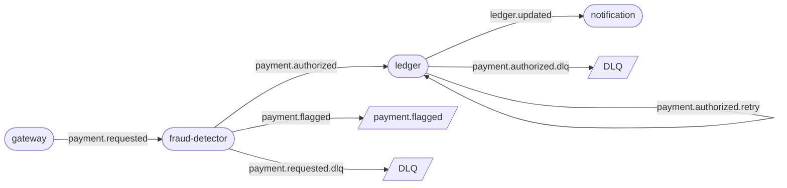

# PayStream

An event-driven payment processing system built on Apache Kafka, demonstrating production-grade patterns for delivery guarantees, idempotency, and error isolation in a distributed fintech context.

Four independent microservices communicate exclusively through Kafka topics — no shared libraries, no direct calls, no parent POM. Each service is a self-contained Maven project with duplicated model classes, reflecting a deliberate microservices boundary decision.

---

## Event Flow



All topics: **3 partitions**, replication factor 1. Message key everywhere is `accountId`, guaranteeing per-account ordering and stable partition assignment.

---

## Stack

| Layer | Technology |
|---|---|
| Language | Java 21 |
| Messaging | Apache Kafka 4.0 (KRaft, no ZooKeeper) · kafka-clients 4.1.2 |
| Database | PostgreSQL 17 · Liquibase 4.31 · HikariCP 6.2.1 |
| Serialization | Jackson 2.21.1 |
| Logging | SLF4J 2.0.16 |
| Build | Maven · maven-shade-plugin (fat JARs) |
| Infrastructure | Docker Compose · kafka-ui (observability) |

The project uses **plain `kafka-clients`**, not Spring Kafka. This is intentional — it forces explicit ownership of the consumer poll loop, offset commits, rebalance handling, and producer configuration: the mechanics Spring Kafka abstracts away.

---

## Architecture

### Services

#### 1. gateway — producer

Generates 100,000 payments with a realistic risk distribution and publishes them to `payment.requested`.

| Profile | Share | Characteristics |
|---|---|---|
| Normal | 80% | Trusted country (US/ES/DE/FR), amount 0–90 EUR |
| Mixed | 15% | Suspicious country OR high amount |
| High-risk | 5% | Suspicious country AND high amount |

The skewed distribution exercises all fraud rule combinations and produces a visible spread across `payment.authorized` and `payment.flagged`.

#### 2. fraud-detector — consume → score → produce

Consumes `payment.requested`, scores each payment via the **Strategy pattern** (`FraudRule` interface), and routes by aggregate risk score (threshold ≥ 50 → flagged).

| Rule | Score | Trigger |
|---|---|---|
| `NegativeAmountRule` | 100 | `amount <= 0` |
| `HighAmountRule` | 40 | `amount > 90` |
| `SuspiciousCountryRule` | 30 | country ∉ {US, ES, DE, FR} |
| `RoundAmountRule` | 15 | no decimal part |

Deserialization errors bypass scoring and go straight to `payment.requested.dlq` with error metadata in Kafka headers.

#### 3. ledger — the most complex service

Consumes `payment.authorized`, writes a transaction journal to PostgreSQL **idempotently**, computes account balance via `SUM`, and publishes `ledger.updated`.

**Threading model:** `ConsumerManager` manages a thread pool executor. Three `PaymentAuthorizedConsumer` threads read the main topic (group: `ledger`); one `PaymentRetryConsumer` thread reads the retry topic (group: `ledger-retry`). Separate groups ensure predictable partition assignment and independent offset tracking.

**Error classification and retry pipeline:**
- **Permanent errors** (malformed JSON, deserialization failure) → DLQ immediately, no retry
- **Transient errors** (DB unavailable, timeout) → `payment.authorized.retry` with `retry-count` header incremented; after 3 attempts → DLQ

The `retry-count` lives in Kafka message **headers**, not in the payload. `AbstractLedgerConsumer` encapsulates the routing logic; both main and retry consumers extend it.

**Database schema:**
```sql
CREATE TABLE transactions (
    id          BIGSERIAL PRIMARY KEY,
    payment_id  VARCHAR(255) UNIQUE NOT NULL,   -- idempotency key
    account_id  VARCHAR(255) NOT NULL,
    amount      NUMERIC(19, 4) NOT NULL,
    currency    VARCHAR(10)  NOT NULL,
    country     VARCHAR(10)  NOT NULL,
    status      VARCHAR(20)  NOT NULL,          -- APPROVED | FLAGGED
    risk_score  INTEGER      NOT NULL,
    created_at  TIMESTAMPTZ  NOT NULL,
    reviewed_at TIMESTAMPTZ  NOT NULL,
    recorded_at TIMESTAMPTZ  NOT NULL DEFAULT NOW()
);
-- indexes on account_id (balance aggregation) and status (analytics)
```

#### 4. notification — pure consumer

Consumes `ledger.updated` (group: `notification`), two threads via `ConsumerManager`. Simulates downstream notification dispatch via structured logging. Designed as an extension point — swap `NotificationSender` for an SMTP/SMS/push implementation.

### Topics

| Topic | Producer | Consumer group | Purpose |
|---|---|---|---|
| `payment.requested` | gateway | `fraud-detector` | Raw payment events |
| `payment.authorized` | fraud-detector | `ledger` | Approved payments |
| `payment.flagged` | fraud-detector | — | Flagged payments (extensible) |
| `payment.requested.dlq` | fraud-detector | — | Fraud-detector DLQ |
| `payment.authorized.retry` | ledger | `ledger-retry` | Transient-error retries |
| `payment.authorized.dlq` | ledger | — | Ledger DLQ |
| `ledger.updated` | ledger | `notification` | Recorded transactions with balance |

---

## Key Technical Decisions

### Idempotency over Exactly-Once Semantics

The ledger writes to PostgreSQL — an external system outside the Kafka transaction boundary. Kafka's EOS (transactional producer + `read_committed` isolation) coordinates atomicity only between Kafka topics; it cannot enroll an external database in the same transaction. Attempting EOS here would create a false sense of safety.

The correct solution is **idempotency at the business layer**:

```sql
INSERT INTO transactions (payment_id, ...)
VALUES (?, ...)
ON CONFLICT (payment_id) DO NOTHING;
```

`payment_id` carries a unique constraint. A redelivered message hits the conflict path and is silently discarded; the consumer commits the offset normally. No duplicate writes, no coordinator overhead, no two-phase commit.

**Verified in practice:** running `kafka-consumer-groups.sh --reset-offsets` and replaying the entire `payment.authorized` topic produces no duplicate rows in PostgreSQL.

EOS *would* be applicable to fraud-detector (Kafka→Kafka, no external system) and is noted as a possible extension below.

### At-Least-Once as a Deliberate Choice

All consumers set `enable.auto.commit=false` and commit offsets manually after processing. A crash before commit causes redelivery — the system is **at-least-once by design**.

The counterpart is idempotent processing at every write point. Reliability is not achieved by preventing retries; it is achieved by making retries safe. This is the operationally correct trade-off: at-least-once with idempotency is simpler, more observable, and more resilient than exactly-once with distributed coordination.

### DLQ Strategy: Error Classification Before Routing

Routing every error to a DLQ uniformly is a mistake: it buries transient failures (DB blip, network timeout) alongside permanent ones (malformed message), making operational triage harder and potentially discarding recoverable work.

PayStream classifies errors before routing:

```
JsonProcessingException  →  DLQ immediately   (permanent: message is broken, retry is pointless)
Exception, retry < 3     →  retry topic        (transient: DB failure, worth retrying)
Exception, retry >= 3    →  DLQ               (exhausted: give up, alert on queue depth)
```

The `retry-count` is stored in Kafka message **headers**, not the payload. This keeps the domain model (`FraudResult`, `LedgerEntry`) free of infrastructure concerns and allows the base consumer class to read and increment the counter without touching the business object.

Separate consumer groups for main and retry streams (`ledger` vs `ledger-retry`) ensure the retry consumer does not compete with or interfere with normal throughput.

### Partitioning by `accountId`

Every message uses `accountId` as the Kafka partition key. This gives two guarantees:

1. **Per-account ordering** — all events for a given account arrive at a single partition in production order. The ledger processes them sequentially, so balance computation is race-free.
2. **Stable affinity** — within a consumer group, one account is always processed by the same consumer thread, making state reasoning straightforward.

With 3 partitions and 3 ledger consumer threads, this is a direct 1:1:1 mapping — one thread owns one partition and all accounts hashed to it.

### `BigDecimal` Comparison via `compareTo`, not `equals`

Financial amounts are stored as `NUMERIC(19, 4)` in PostgreSQL and as `BigDecimal` in Java. `BigDecimal.equals` is scale-sensitive: `new BigDecimal("2.50").equals(new BigDecimal("2.5"))` returns `false`. All amount comparisons in fraud rules use `compareTo` to be scale-agnostic. The column precision (`19, 4`) prevents silent truncation of fractional amounts.

---

## How to Run

### Prerequisites
- Docker + Docker Compose
- Java 21, Maven 3.9+

### 1. Start infrastructure

```bash
docker compose up -d
```

Starts: Kafka (KRaft, port 9092), PostgreSQL (port 5432), Liquibase migrations (runs automatically), kafka-ui (port 8080).

Wait for kafka-ui at **http://localhost:8080** to confirm the broker is healthy.

### 2. Build all services

```bash
for svc in fraud-detector ledger notification payment-gateway; do
  (cd $svc && mvn clean package -q)
done
```

### 3. Start consumers first

Start consumers before the gateway so partition assignment stabilizes before messages arrive. This is not strictly required — Kafka persists all messages and consumers replay from `earliest` — but it avoids a rebalance burst at startup.

```bash
# Terminal 1
java -jar fraud-detector/target/fraud-detector-*.jar

# Terminal 2
java -jar ledger/target/ledger-*.jar

# Terminal 3
java -jar notification/target/notification-*.jar
```

### 4. Start the gateway

```bash
java -jar payment-gateway/target/payment-gateway-*.jar
```

The gateway produces 100,000 payments and exits. Monitor progress in kafka-ui.

### Observe results

```bash
# Consumer group lag
docker exec -it $(docker compose ps -q kafka) \
  kafka-consumer-groups.sh --bootstrap-server localhost:9092 --describe --all-groups

# Transaction summary
docker exec -it $(docker compose ps -q postgres) \
  psql -U ledger -d ledger -c \
  "SELECT status, COUNT(*), SUM(amount) FROM transactions GROUP BY status;"

# Replay test (proves idempotency)
docker exec -it $(docker compose ps -q kafka) \
  kafka-consumer-groups.sh --bootstrap-server localhost:9092 \
  --group ledger --topic payment.authorized \
  --reset-offsets --to-earliest --execute
# restart ledger — row count in PostgreSQL must not change
```

---

## What This Project Demonstrates

For a technical reviewer, PayStream is evidence of:

| Skill | Where |
|---|---|
| Kafka consumer mechanics | Manual offset commits, poll loop, `AUTO_OFFSET_RESET=earliest`, manual rebalance handling |
| Delivery guarantee reasoning | Conscious choice of at-least-once over EOS, with rationale for why EOS does not apply across a Kafka→DB boundary |
| Idempotency patterns | `ON CONFLICT DO NOTHING` on a business key; verified by offset reset and replay |
| Error isolation | Two-tier DLQ: permanent vs transient, error classification before routing, retry-count in headers |
| Partition design | Key selection (`accountId`) to enforce ordering and eliminate balance race conditions |
| Threading model | `ConsumerManager` thread pool, graceful shutdown with 30s drain, separate groups per stream |
| Strategy pattern | `FraudRule` interface, composable rule chain, aggregate scoring with configurable threshold |
| Fintech precision | `NUMERIC(19, 4)` column, `BigDecimal.compareTo` throughout |
| Infrastructure as code | Kafka KRaft (no ZooKeeper), Liquibase migrations, HikariCP connection pool, Docker Compose |
| Microservices boundaries | No shared libraries, intentional model duplication, fully independent deployability |

---

## Possible Extensions

- **EOS for fraud-detector** — the fraud-detector pipeline is Kafka→Kafka (no external system), making it a valid candidate for transactional producers and `read_committed` consumers. Not implemented here to keep the idempotency vs EOS distinction explicit and visible.
- **Compacted `account.balance` topic** — publish running account balance as a compacted changelog, allowing any service to bootstrap current balance without querying PostgreSQL.
- **REST API** — expose payment submission and balance queries via a Spring Boot gateway, replacing the internal generator with a real HTTP entry point.
- **Schema Registry** — replace JSON with Avro + Confluent Schema Registry for schema evolution and contract enforcement between services.
- **Observability** — Micrometer + Prometheus metrics for consumer lag, processing latency per stage, retry rate, and DLQ queue depth.
